# 介紹Git的操作

## 1.安裝完Git後，可開啟vscode檢查是否正確安裝

1.打開vscode左上角的Terminal->New Terminal。

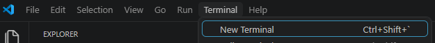

2.在底下視窗輸入`git --version`，如果有跑出版本號就代表已成功安裝。

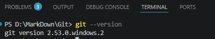

---

## 2.使用Git前必須先設定姓名和電子郵件，因為Git在記錄版本變更時也會記錄作者資訊

1. 姓名設定方式為輸入`git config --global user.name "自己的姓名"`。

2. 電子郵件設定方式為輸入`git config --global user.email "自己的電子郵件"`。

---

## 3.把目前資料夾轉成具有版本功能的儲存庫

輸入`git init` : 這個指令會在當前目錄建立一個隱藏.git子資料夾，
用來儲存檔案變更歷史。不小心刪除的話**所有歷史和備分紀錄都會消失**。

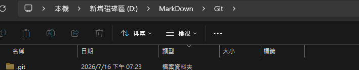

---

## 清空指令

終端機指令太多可以輸入`clear`來清空內容。

---

## 檢查當前目錄中的檔名和狀態

輸入`git status`

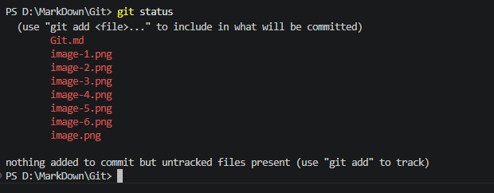

紅字為未追蹤的檔案。

---

## 將未追蹤的檔案放到放到暫存區

輸入`git add 檔案名稱`，送出後會發現左邊檔案列表所選的檔案會出現A代表已成功放至暫存區。

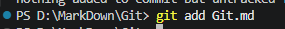

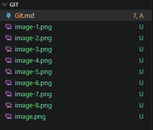

可用`git status`再檢查一次，會用綠色來標示。

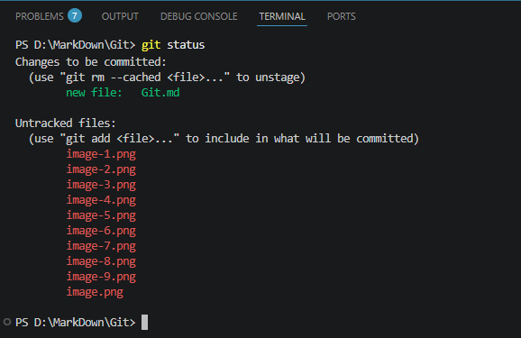

另外一種更方便的指令`git add .`是將這個目錄下的所有檔案都存放進來。

---

## 紀錄版本變更

若有做任何修改，左方檔案列表會出現M，提醒你尚未記錄。

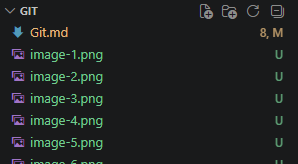

這時先輸入`git add .`將欲紀錄的檔案放入暫存區。
再輸入`git commit -m "內容"`，內容為本次修改的描述。

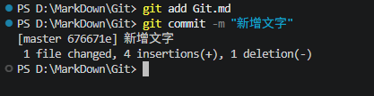

這時左方檔案列表的M就消失了代表已成功紀錄。

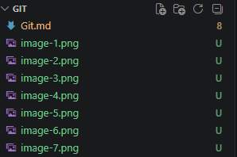

---

## 檢視歷史紀錄

輸入`git log`，這個指令會顯示先前提交的修改紀錄(提交者、時間、說明文字)
，**按下q即可離開檢視**。

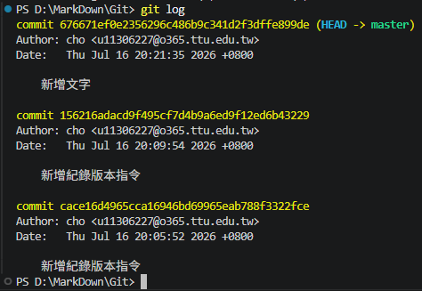

另一個指令`git log --oneline`，這個指令是git log指令的簡化版，適合快速瀏覽過去紀錄。

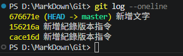

---

## 比較新舊版本內容差異與還原

先輸入`git log`或`git log --oneline`取得版本編號(前7個字符)。

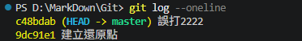

再輸入`git diff 編號 -- 檔案名稱`查看差異，紅色為舊版本，綠色為最新版本。

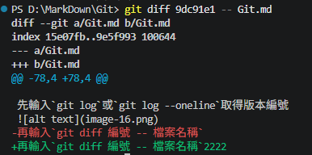

最後確認完版本後輸入`git checkout 還原點編號 -- 檔案名稱`，
就會發現檔案被還原到所選編號紀錄。還原後一樣要提交版更變更紀錄。

以上還原操作保留了完整的歷史紀錄，是一種比較保險的做法。

***注意!!以下操作不可逆***

但有時想要將全部檔案還原到某個時間點並捨棄掉之後的存檔紀錄，可以輸入
`git reset --hard 欲還原之本版編號`

---

## 目錄新增和刪除文件

新增文件時要用`git add 檔名`和`git commit -m "內容"`來新增至暫存區和提交變更紀錄，
這個沒有問題。

但當刪除文件後，你輸入`git status`檢查當前目錄狀態時，會發現被刪除的文件被標示為尚未暫存的變更。

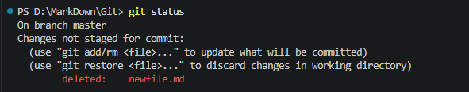

這時一樣使用`git add 檔名`和`git commit -m "內容"`來新增至暫存區和提交變更紀錄就可以了。

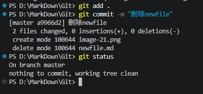

有些人可能不理解檔案都被刪除了我還能追蹤甚麼，這時帶出git的觀念，**Git追蹤的是檔案變化**，而非檔案本身。所以對於git來說，刪除檔案這個動作一樣需要被追蹤和提交紀錄。

---

## 忽略檔案清單

當你在專案資料夾進行操作時，有些檔案可能不需要被追蹤和建立版本紀錄。

這時可以建立一個`.gitignore`的檔案，並且把要忽略的檔名或副檔名寫在裡面。

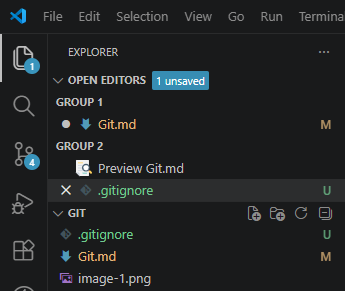

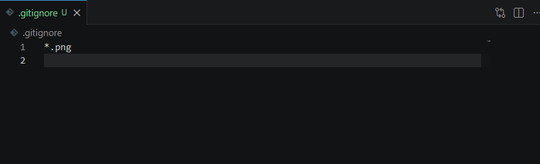

這樣git在做版本提交時就能避免無關的檔案混入，不但維持整個專案的整潔，也能避免私人資料被提交到git儲存庫。

---

## 將專案上傳至Github

登入Github帳號後，在主頁面點選`New repository`建立新的儲存庫。
建立完後會發現頁面底下Github有提供現成的指令來協助我們把本地的檔案傳送到雲端。

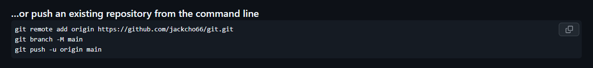

直接複製貼到欲上傳檔案的終端即可。

第一行
: 用來連結本地與遠端儲存庫

第二行
: 把master改成main

第三行
: 把本地位於main分支的資料推到雲端

---

## 將本地內容更新上傳Github

再欲上傳的文件終端輸入`git push`

---

## 邀請其他人參與專案

在Github儲存庫上點選`setting`->`collaborators`->`Add people`

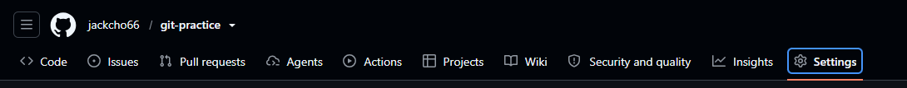

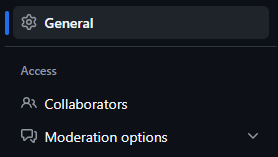

---

## 下載他人儲存庫到本地端電腦使用

點選`code`->`複製儲存庫連結`

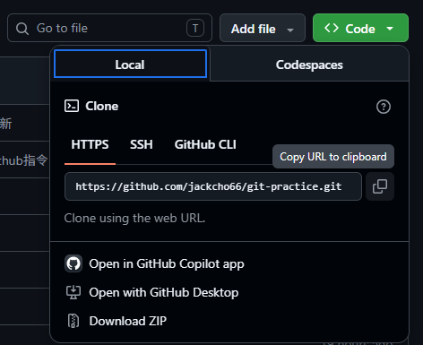

回到個人VsCode在終端輸入`git clone 貼上連結`

下載好的儲存庫會變成一個子資料夾。

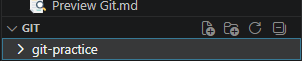

如果要編輯該儲存庫的內容要輸入`cd 該資料夾名稱`，切換過去後就可以用git指令操作該儲存庫。

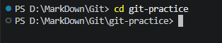

假設有人使用`git push`提交了新的文件時，
其他協作者只要輸入`git pull`就能將新文件拉回自己的本地端。

---

## 建立分支

輸入`git checkout -b 分支名稱`
這樣的好處在於可以自由地在分支進行編輯而不用擔心破壞到主分支

建立分支後，若要提交檔案到Github上要輸入`git push origin 分支名稱`

此時回到Github頁面時會發現分支頁面變成2個

---

## 發起合併請求

---

## 學習心得分享

我認為Git這個東西，最快的學習方法是直接隨便拿一個文檔花一到兩個小時照著做就可以學到怎麼使用常用語法了，剩下的有需要再查就可以了。簡單講就是**實做中學習**。

---
